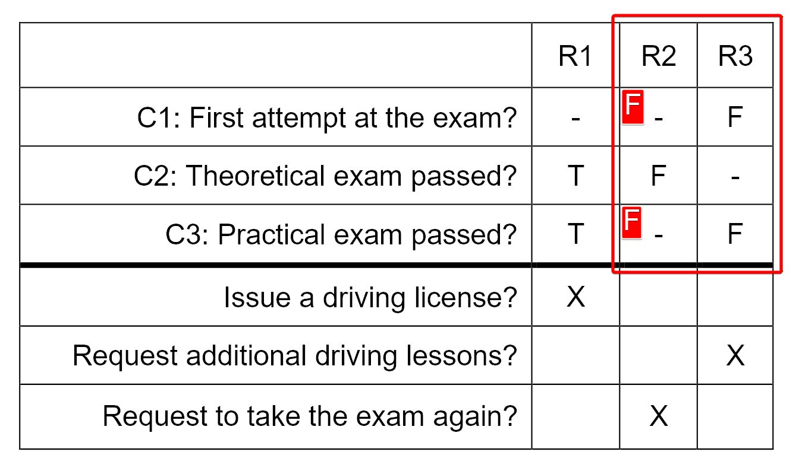
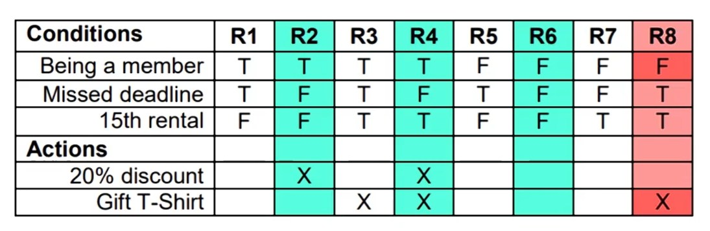
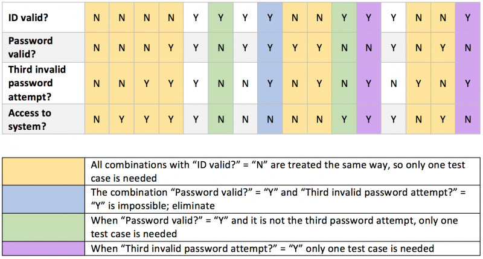
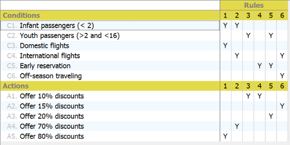

# Decision Table Testing

Decision tables are used for 
- testing the implementation of requirements that specify 
- how different combinations of conditions 
- result in different outcomes. 

Decision tables are an effective way of recording complex logic, such as 
- **business rules** (R1, R2, R3...). 

When creating decision tables, the conditions and the resulting actions of the system are defined. These form the rows of the table. Each column corresponds to a decision rule that defines a unique combination of conditions, along with the associated actions. In 
- **limited-entry decision tables** all the values of the
conditions and actions (except for irrelevant or infeasible ones; see below) are shown as 
    - Boolean values (true or false). 
    
Alternatively, in 
- **extended-entry decision tables** some or all the conditions and actions may
also take on multiple values (e.g., 
    - ranges of numbers, 
    - equivalence partitions, 
    - discrete values).

The notation for conditions is as follows: 
- “T” (true) means that the condition is satisfied. 
- “F” (false) means that the condition is not satisfied. 
- “–” means that the value of the condition is irrelevant for the action outcome. 
- “N/A” means that the condition is infeasible for a given rule. 

For actions: 

- “X” means that the action should occur. 
- Blank means that the action should not occur. 

Other notations may also be used.

A full decision table has enough columns to cover **every combination** of conditions. 

The table can be simplified by deleting columns containing infeasible combinations of conditions. 

**The table can also be minimized** by merging columns, in which some conditions do not affect the outcome, into a single column. Decision table minimization algorithms are out of scope of this syllabus.

**To achieve 100% coverage** with this technique, test cases must exercise all feasible combinations of conditions columns. 
`coverage% = number of exercised columns / total number of feasible columns`

The strength of decision table testing is that it provides a **systematic approach** to identify all the combinations of conditions, some of which might otherwise be overlooked. It also helps to find any 
- gaps or 
- contradictions in the requirements. 

**A minimized decision table or a risk-based** approach may be used if there are many conditions, exercising all the decision rules may be time consuming, since the number of rules grows exponentially with the number of conditions. In such a case, to reduce the number of rules that need to be exercised.

A **Rule** is a specific combination of condition values (plus the resulting action).

**Omission** happen when The combination of conditions does not match any rule: 

**Contradiction** happen if The combination of conditions matches more then one rule:

