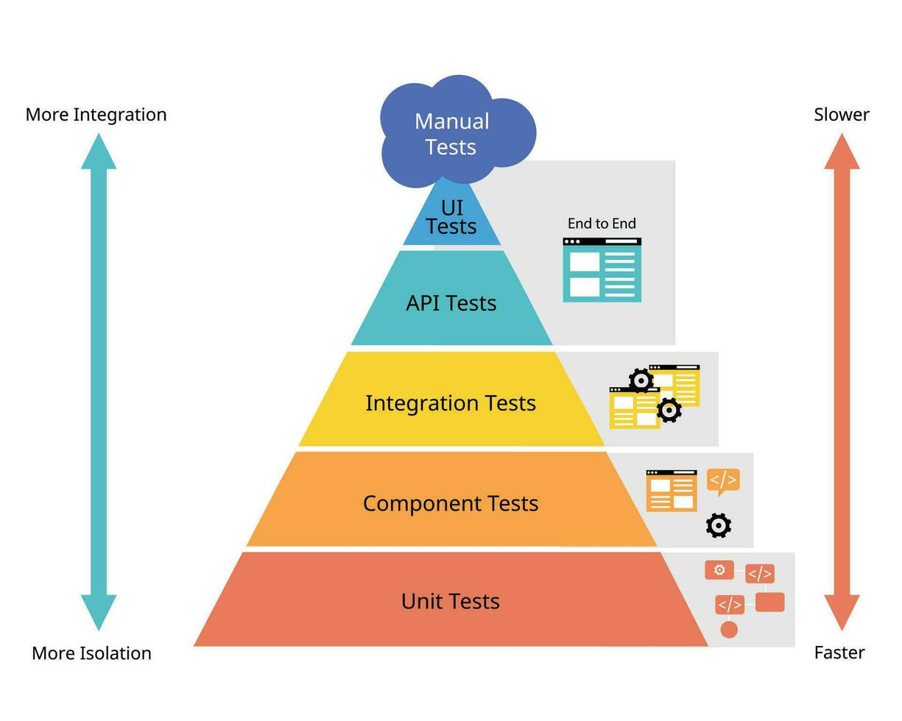
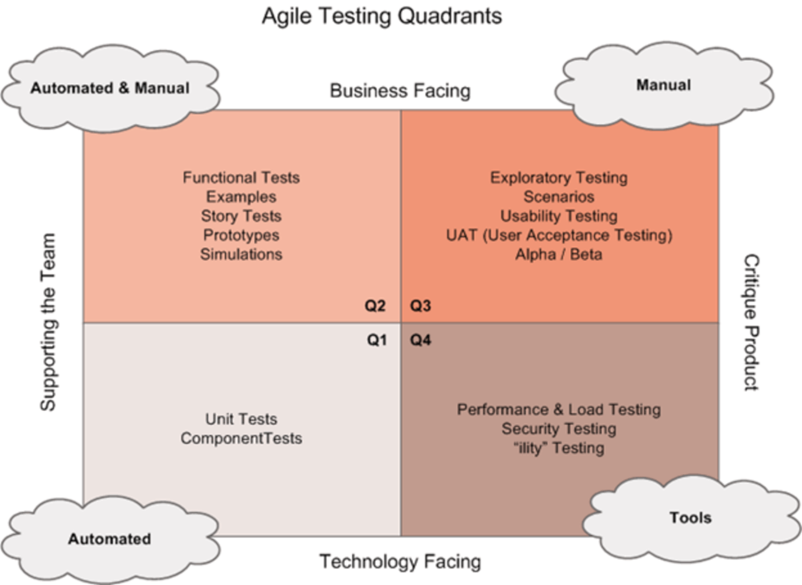

# Test Planning

**A test plan** describes the test objectives, resources and processes for a test project, documents the means and 📅schedule for achieving test objectives🎯. Requirements Phase (Best Time to Draft the Initial Test Plan).

**Entry criteria** define the preconditions for undertaking a given activity. If entry criteria are not met, it is likely that the activity will prove to be more difficult, time-consuming, costly, and riskier. Entry criteria that a user story must fulfill to start the development and/or testing activities are called **Definition of Ready**

**Exit criteria** define what must be achieved to declare an activity completed. Entry criteria and exit criteria should be defined for each test level, and will differ based on the test objectives. Running out of time or budget can also be viewed as valid exit criteria. In Agile software development, exit criteria are often called **Definition of Done**.

### Estimation Techniques
- Estimation based on ratios.
- Extrapolation 📈
- Wideband Delphi / Planning Poker is a variant of Wideband Delphi, commonly used in Agile software developmen
- Three-point estimation 3️⃣

For example, if in the previous project the **development-to-test effort ratio** was `3:2`, and in the
current project the development effort is expected to be 600 person-days, the test effort can be estimated to be 400 person-days. 

The team usually **extrapolate the test effort** in the forthcoming iteration as the averaged effort from the last three iterations.

**Three-point estimation**. experts: the most optimistic estimation (a), the most likely estimation (m) and the most pessimistic estimation (b). 
The final estimate (E) usually calculated as `E = (a + 4*m + b) / 6.` measurement error: `SD = (b – a) / 6.`

### Test Case Prioritization
- **Risk-based prioritization**, where the order of test execution is based on the **results of risk analysis**. Test cases covering the most important risks are executed first.

- **Coverage-based prioritization**, where the order of test execution is based on coverage (e.g.,
statement coverage). Test cases achieving the highest coverage are executed first. In another variant, called **additional coverage prioritization**, the test case achieving the highest coverage is executed first; each subsequent test case is the one that achieves the highest additional coverage.

Answer: `(TC2)`  Order: TC1, TC3, TC4, TC2
- **Requirements-based prioritization**, where the order of test execution is based on the priorities of
the requirements traced back to the corresponding test cases. Requirement priorities are defined
by stakeholders. Test cases related to the most important requirements are executed first.

### Test Pyramid
The test pyramid is a model showing that different tests may have different granularity. The pyramid layers represent groups of tests. The higher the layer, the lower the test granularity, the lower the test isolation and the higher the test execution time. The original test pyramid model defines three layers:
- “unit tests”
- “service tests” 
- “UI tests

More detailed aapoach:
- unit tests
- Components tests
- Integration tests
- API tests
- UI tests
- Manual tests

Granularity = the scope/level of detail at which tests operate:
- Unit tests = fine/high granularity (most detailed, smallest scope)
- Integration tests = medium granularity (middle scope)
- End-to-end tests = coarse/low granularity (least detailed, largest scope)



### [Testing Quadrants](https://www.tricentis.com/learn/agile-testing-quadrants)
The testing quadrants, group the test levels with the 
 - appropriate test types, 
 - activities, 
 - test techniques and 
 - work products in the Agile software development. 
 
The model supports test management in visualizing these to ensure that all appropriate test types and test levels are included in the SDLC.

Testing quadrants group test levels and test types by several criteria such as targeting specific stakeholders

Do NOT represent any combinations of test levels and test types.

```
    Testing Pyramid     → Test Levels
    ─────────────────────────────────────────
    Unit Tests          → Unit Testing
    Integration Tests   → Integration Testing
    End-to-End/UI Tests → System Testing + Acceptance Testing
```



- **Quadrant Q1** (technology facing, support the team). This quadrant contains component tests and component integration tests. These tests should be automated and included in the CI process.
- **Quadrant Q2** (business facing, support the team). This quadrant contains functional tests, examples, user story tests, user experience prototypes, API testing, and simulations. These tests check the acceptance criteria and can be manual or automated.
- **Quadrant Q3** (business facing, critique the product). This quadrant contains exploratory testing, usability testing, user acceptance testing. These tests are user-oriented and often manual.
- **Quadrant Q4** (technology facing, critique the product). This quadrant contains smoke tests and non-functional tests (except usability tests). These tests are often automated

### Risk Management

The main **risk management activities** are:
- Risk analysis
    - risk identification
    - risk assessment
- Risk control
    - risk mitigation
    - risk monitoring

**Risk-based testing** is the test approach, in which **test activities** are:
- selected, 
- prioritized and
- managed based on 
    - risk analysis and 
    - risk control.

#### Risk definition and risk attributes
- Risk likelihood (probability of risk occurence) `0 > risk < 1`
- Risk impact (harm) the consiquences of this occurence
These two factors express the `Risk Level = Risk Likelihood × Risk Impact` which is the measure of the risk.

Example scale

| Factor     | Values                        |
| ---------- | ----------------------------- |
| Likelihood | 1 (Low) – 5 (Very High)       |
| Impact     | 1 (Negligible) – 5 (Critical) |

**Risk Matrix**

| Impact ↓ / Likelihood → | 1 | 2  | 3  | 4  | 5  |
| ----------------------- | - | -- | -- | -- | -- |
| **5 Critical**          | 5 | 10 | 15 | 20 | 25 |
| **4 High**              | 4 | 8  | 12 | 16 | 20 |
| **3 Medium**            | 3 | 6  | 9  | 12 | 15 |
| **2 Low**               | 2 | 4  | 6  | 8  | 10 |
| **1 Negligible**        | 1 | 2  | 3  | 4  | 5  |

Typical thresholds:

* **High risk**: 15–25 → must be mitigated `>60%`
* **Medium risk**: 6–14 → monitor / partially mitigate `25-60%`
* **Low risk**: 1–5 → accept `0-25%`

---

**Extended formula (less common, more formal)**

⚠️ In safety-critical or financial domains, risk can be extended:

**Risk Level = Likelihood × Impact × Exposure**

Where:

* **Exposure** = how often the system is used or how many users are affected

Example:

* Likelihood = 0.1
* Impact = 9
* Exposure = 1000 users

Risk = 900

This helps prioritize risks affecting many users even if probability is low.

---

## 4. How this is applied in testing (important for you)

In **risk-based testing**, risk level is used to:

* Decide **what to test first**
* Allocate **more tests to high-risk areas**
* Decide **depth of testing**

Typical mapping:

* **High risk** → automated + exploratory + negative tests
* **Medium risk** → functional + some edge cases
* **Low risk** → smoke or minimal coverage
